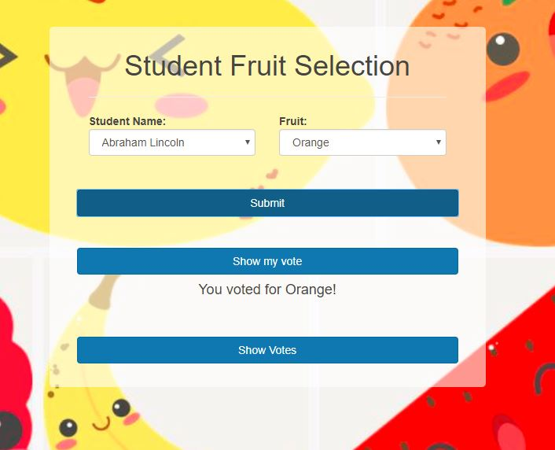

# Voting App
This application allows students of a school to vote for their favorite fruit from a selection of fruits. This data will be used by the school to decide which fruit to provide students, using the total number of votes per fruit. The application prints a table, which shows the total number of votes for each fruit sorted in descending order of number of votes. This application also allows students to see their votes and modify them if they wish to change their preference.

# Installation
Make sure that the following prerequisites are installed for running the application:
* JDK 1.8 or later
* Maven 3.0+
# Configuring database access parameters
You can edit the database parameters by editing the `./src/main/resources/static/database.txt` file. This is a space-delimited file of the format:
```
jdbc:mysql://<mysql-server-address>/<database-name> <mysql-username> <mysql-password>
```
In the following example, the mysql server is running at `localhost:3306` and the `student` database can be accessed using the user name `voting` and password `app`:
```
jdbc:mysql://localhost:3306/student voting app
```
# Running the application
The following caommand can be used to run the application:
```
./mvn spring-boot:run
```
Once the application is started, you can access the voting app at: `http://localhost:8080`

# Architecture
The website is built using Vue.js, a modern client-side framework, which interacts with RESTful APIs provided by the server. The server stores the requisite information for the application in a MySQL database.
## Client framework
* Vue.js is used to render the UI for the application. It is installed by including its CDN (https://unpkg.com/vue@2.0.3/dist/vue.js) via the `<script>` HTML tag in the `index.html`.
* Axios is used to invoke the RESTful HTTP APIs provided by the server. It is installed by including its CDN (https://unpkg.com/axios@0.12.0/dist/axios.min.js) as well
* Lodash is used to modularize the Javascript code. This too is installed from its CDN (https://unpkg.com/lodash@4.13.1/lodash.min.js
)
* Bootstrap CSS is used to manage the CSS settings (and to make things look nicer): https://maxcdn.bootstrapcdn.com/bootstrap/3.3.7/css/bootstrap.min.css
* styles.css and grid.css provide further customization of the user interface
## Server
RESTful APIs provided by the server are implemented using the Java Spring framework. Maven is used to build and deploy the same.
### APIs
The following RESTful APIs are provided by the server:
#### 1. POST /vote
The `POST /vote HTTP/1.1` method accepts name and fruit selection of a student and records the same in the database. The JSON encoded request body is accepted to be of the format:
```
{
    name: String,
    fruit: String
}
```
If successful, a JSON response of the same format is returned to the client. This method is used to record students' votes in the database.
#### 2. GET /vote
The `GET /vote HTTP/1.1` method prints the name and fruit selection of a student from the database, provided the name of the student. An example request for the same is of the form: `GET /vote?name=Jane` returns a JSON response on success. The JSON response is of the format:
```
{
    name: String,
    fruit: String
}
```
This method is used to fetch the vote for a student in the application.
#### 3. GET /votes
The `GET /votes HTTP/1.1` method fetches the number of votes for each fruit in the database and returns the same as a JSON response. The list is ordered by the number of votes for each fruit. This method does not accept any parameters. The JSON response is of the format:
```
{
    [{
   	 name: String,
   	 fruit: String
    },
    ...
    ]
}
```
This method is used to print the number of votes per fruit in the application.
#### 4. GET /fruits
The `GET /fruits HTTP/1.1` method fetches the list of fruits from the database, sorted in decreasing order by the number of votes for each fruit as a JSON response. The JSON response is of the format:
```
{
    [String, String, ...]
}
```
This method is used to populate the dropdown list of fruits in the application.
#### 5. GET /students
The `GET /students HTTP/1.1` method fetches the list of students from the database. The JSON response is of the format:
```
{
    [String, String, ...]
}
```
This method is used to populate the dropdown list of students in the application.
## Datastore
A MySQL database is used to recode the information regarding studens, fruits available and the votes of each student.
### Database Schema
The following tables store the information in the `student` database:

| Table Name | Description |
|------------|-------------|
| Student	| Stores information of all students eligible to vote |
| Fruits 	| Stores all the fruits which are available for the students to vote |
| StudentSelection | Stores the name of the students and their fruit selection |

The tables are designed to maintain the referential integrity and are normalized.
